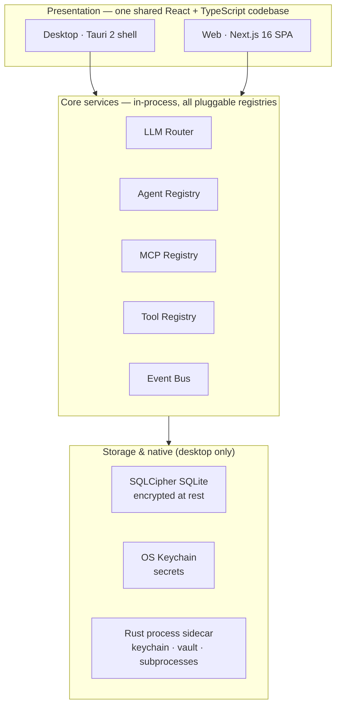
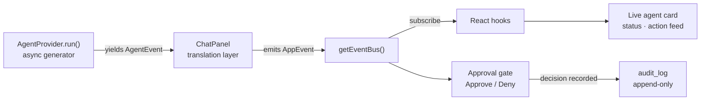
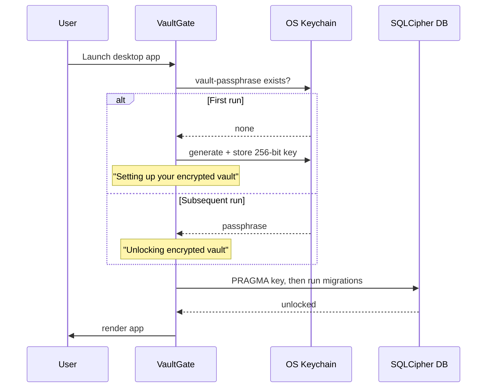

<div align="center">

# Agent Command Center

**A spatial mission control for AI agents.** Run an LLM chat agent, a Claude Code session, and an
OpenAI Codex session side by side on one infinite canvas — wire them together, watch their actions
stream in real time, and approve what they do before it happens.

One React/TypeScript codebase that ships as both a **native desktop app** (Tauri 2) and a **web app**
(Next.js 16).


</div>

---

## Table of contents

- [What is this?](#what-is-this)
- [Architecture at a glance](#architecture-at-a-glance)
- [Features](#features)
- [Supported LLM providers](#supported-llm-providers)
- [Agent runtimes](#agent-runtimes)
- [How an agent run flows](#how-an-agent-run-flows)
- [Security model](#security-model)
- [Quick start](#quick-start)
- [Extending the app](#extending-the-app)
- [Project structure](#project-structure)
- [Scripts](#scripts)
- [Testing](#testing)
- [Roadmap](#roadmap)
- [Contributing](#contributing)
- [License](#license)

---

## What is this?

Most agent tooling hides the agent inside a chat box. **Agent Command Center makes the agent a
first-class object you can see and steer.** Every agent is a card on an infinite, zoomable canvas
that shows its live status, its streaming action feed, and an inline Approve / Deny prompt the
moment it tries to do something sensitive.

It is built as a **client-side SPA** with a thin **Rust sidecar** for the things browsers can't do —
OS keychain access, an encrypted local database, and managed CLI subprocesses. The same code runs in
a desktop window or in a browser tab; native capabilities light up automatically on the desktop
build.

The core architectural bet is **extension by registration**: adding a new LLM provider, agent
runtime, canvas node, or tool means implementing one interface and dropping it into a `Map` — never
editing existing code. See [Extending the app](#extending-the-app).

---

## Architecture at a glance



Producers (agent runtimes, the canvas, the Rust sidecar) and consumers (the React UI) never talk
directly — they communicate through the typed **event bus**
([`src/lib/event-bus.ts`](src/lib/event-bus.ts)), which keeps every layer decoupled.

For the full design rationale, see the
[design spec](docs/superpowers/specs/2026-06-18-agent-command-center-design.md).

---

## Features

- **Spatial canvas** — every agent is a draggable card on an infinite, zoomable
  [React Flow](https://reactflow.dev) canvas. Group cards, wire them together, and watch a live
  action feed and status light on each. Positions and viewport persist across launches.
- **Any agent, any provider** — in-process LLM chat agents (via the
  [Vercel AI SDK](https://ai-sdk.dev)) alongside full agentic coding runtimes (**Claude Code**,
  **OpenAI Codex**) running as managed child processes.
- **Pluggable LLM router** — six providers ship in the box (see below). Swap the model behind any
  agent without losing its history.
- **Subscription sign-in** — use your **Claude Pro/Max** or **ChatGPT Plus/Pro** plan in ordinary
  chat cards without an API key, routed through the official `claude` / `codex` CLIs.
- **Approval gates** — destructive or out-of-scope actions surface as inline Approve / Deny prompts
  on the card, color-coded by risk, *before* they execute.
- **MCP support** — connect [Model Context Protocol](https://modelcontextprotocol.io) servers over
  `stdio` or `sse` and expose their tools to agents. Browse and install from a built-in catalog.
- **Built-in tool tier** — a `ToolDefinition` registry with web search, file read/write, shell,
  headless browser, and image generation, each gated by an explicit permission scope.
- **Encrypted, local-first storage** — agents, sessions, models, tools, MCPs, and canvas layout
  persist to a **SQLCipher-encrypted** SQLite database. API keys live in the OS keychain, never in
  the database.
- **Tools, MCPs & Skills store** — a panel for browsing, installing, and assigning capabilities per
  agent.

---

## Supported LLM providers

All six are registered out of the box in
[`PROVIDER_REGISTRY`](src/lib/llm/providers/index.ts). Adding a seventh is one interface + one
registration.

| Provider | Auth | Headline models | Notes |
|----------|------|-----------------|-------|
| **Anthropic** | API key | Claude Opus 4.8 · Sonnet 4.6 · Haiku 4.5 | 200K context, tools + streaming |
| **Google Gemini** | API key | Gemini 2.5 Pro · 2.5 Flash · 2.0 Flash | 1M context, tools + streaming |
| **OpenAI** | API key | GPT-4o · GPT-4o Mini · o3 | 128K–200K context (o3 is non-streaming) |
| **Ollama** | None (local) | Whatever your server lists | Auto-discovered from a running Ollama instance |
| **Claude (subscription)** | CLI | Claude Sonnet · Opus | Routes through the `claude` CLI — desktop only |
| **Codex (subscription)** | CLI | gpt-5-codex | Routes through the `codex` CLI — desktop only |

API keys are stored only in the OS keychain; the database keeps a reference, never the secret.

---

## Agent runtimes

Three runtimes are registered in [`AGENT_REGISTRY`](src/lib/agents/registry.ts):

| Runtime | Icon | What it is | Project dir? |
|---------|------|------------|:---:|
| **LLM Agent** | 🤖 | Streaming chat loop via the Vercel AI SDK `streamText()` — runs entirely in-process | — |
| **Claude Code** | 🧑‍💻 | The `claude` CLI driven as a managed subprocess; reads/writes files and runs commands | required |
| **Codex** | ⚡ | The `codex` CLI driven as a managed subprocess | required |

Coding agents are sandboxed to their assigned project directory and surface out-of-scope actions as
approval requests. (Their runtime keys `claude-code` / `codex` map to the persisted `coding-agent` /
`custom` types via `resolveAgentRuntimeType()`.)

---

## How an agent run flows

`AgentProvider.run()` is an async generator that yields `AgentEvent`s as work happens. `ChatPanel`
translates those into typed `AppEvent`s on the event bus, and React hooks turn them into live UI —
card status, the action feed, and approval gates.



> `AgentEvent` (what a runtime yields) and `AppEvent` (what the bus carries) are deliberately
> distinct — `ChatPanel` is the single translation point between them.

---

## Security model

- **API keys never touch the database.** Secrets live in the OS keychain (Windows Credential
  Manager · macOS Keychain · libsecret) via the Rust `set_secret` / `get_secret` commands; the
  database stores only a *reference* to the keychain entry.
- **Encrypted at rest.** The local database is a **SQLCipher** file. A 256-bit passphrase is
  generated on first run and stored in the keychain (`vault-passphrase`); the native `vault_open`
  command runs `PRAGMA key` *before any migration touches the file*.
- **Vault unlock on launch.** [`VaultGate`](src/components/vault/VaultGate.tsx) gates the desktop app
  on unlock — first-run setup vs. subsequent unlock, with a retry on failure. Web mode has no
  keychain/SQLite and renders the (degraded) shell directly.
- **Zero-trust agents.** Each run carries an explicit permission scope (allowed paths, allowed
  domains, shell on/off). Coding agents are additionally sandboxed to a project directory.
- **Approval gates.** Sensitive actions pause for an explicit Approve / Deny before executing.
- **Auditable.** Tool calls and approval decisions are recorded in an append-only `audit_log` table.



Full details in [SECURITY.md](SECURITY.md).

---

## Quick start

### Prerequisites

- **Node.js** 20+
- **Rust** (stable) and the [Tauri prerequisites](https://tauri.app/start/prerequisites/) — desktop
  build only
- An API key for at least one LLM provider (Anthropic, OpenAI, Google), a local
  [Ollama](https://ollama.com) instance, or a Claude/ChatGPT subscription with the official CLI
  installed

### Run in the browser

```bash
npm install
npm run dev
```

Open [http://localhost:3000](http://localhost:3000).

> In browser-only mode the Tauri-backed features — OS keychain secrets, the encrypted vault, and the
> subprocess coding agents (Claude Code / Codex) — are unavailable, because they are implemented as
> native commands in the Rust sidecar. Use the desktop build for the full feature set.

### Run as a desktop app

```bash
npm install
npm run tauri:dev
```

This launches the Next.js dev server and the Tauri shell together.

---

## Extending the app

Adding a capability means implementing one interface and registering it — **no edits to existing
code**. The contracts live in [`src/lib/interfaces/`](src/lib/interfaces/).

| Concept | Interface | Registry |
|---------|-----------|----------|
| Agent runtime | [`AgentProvider`](src/lib/interfaces/agent-provider.ts) | [`AGENT_REGISTRY`](src/lib/agents/registry.ts) |
| LLM provider | [`LLMProvider`](src/lib/interfaces/llm-provider.ts) | [`PROVIDER_REGISTRY`](src/lib/llm/providers/index.ts) |
| Canvas node | [`CanvasNode`](src/lib/interfaces/canvas-node.ts) | [`NODE_REGISTRY`](src/lib/canvas/node-registry.ts) |
| Tool | [`ToolDefinition`](src/lib/interfaces/tool-definition.ts) | [`TOOL_REGISTRY`](src/lib/tools/registry.ts) |
| App event | [`AppEvent` union](src/lib/interfaces/event-bus.ts) | [`getEventBus()`](src/lib/event-bus.ts) |

The most common recipes are encoded as project skills under `.claude/skills/` —
`add-llm-provider`, `add-storage-table-repository`, `add-tauri-command`, `add-app-event-and-hook`,
and `new-feature-panel`. See [CONTRIBUTING.md](CONTRIBUTING.md) for the conventions.

---

## Project structure

```
src/
  app/                      Next.js App Router entry (page.tsx is the canvas shell — one client route)
  components/
    canvas/                 React Flow canvas, agent cards, edges, groups
    agents/  approval/      Agent creation panel, approval gate
    chat/    settings/      Chat panel, model/provider settings
    store/   vault/         Tools/MCP/Skills store, encrypted-vault unlock gate
    layout/  ui/            Sidebar, top/status bars, primitives
  hooks/                    React hooks bridging the event bus to component state
  lib/
    interfaces/             The extensibility contracts (start here)
    agents/                 AgentProvider implementations + AGENT_REGISTRY
    llm/                    LLM router + provider implementations + PROVIDER_REGISTRY
    tools/                  ToolDefinition registry + built-in tools
    canvas/                 Node registry and canvas persistence
    mcp/    store/          MCP registry and store catalog
    storage/                SQLCipher schema, db, and per-table repositories
    event-bus.ts            Typed in-process pub/sub
    keychain.ts             OS keychain access (via Tauri)
src-tauri/                  Rust sidecar: keychain, SQLCipher vault, child-process commands
e2e/                        Playwright (web-mode) end-to-end tests
docs/                       Design spec, implementation plans, and the progress ledger
```

---

## Scripts

| Command | Description |
|---------|-------------|
| `npm run dev` | Start the Next.js dev server (web mode, Turbopack) |
| `npm run build` | Production static-export build of the web app (emits `out/`) |
| `npm run start` | Serve the production web build |
| `npm run lint` | Run ESLint |
| `npm test` | Run the Vitest unit/component suite |
| `npm run tauri:dev` | Run the desktop app in development |
| `npm run tauri:build` | Build a distributable desktop binary |

End-to-end tests use Playwright (`playwright.config.ts`): `npx playwright test`.

---

## Testing

- **Unit/component:** [Vitest](https://vitest.dev) + jsdom, co-located in `__tests__/` directories.
  The Tauri boundary (`invoke`, the SQL plugin, `listen`) is mocked at the module level.
- **End-to-end:** [Playwright](https://playwright.dev) in web mode (Chromium against `next dev`);
  native persistence is out of scope there.
- **Rust:** `cargo test` in `src-tauri/`.

The current verified baseline is tracked in
[`docs/superpowers/plans/PROGRESS.md`](docs/superpowers/plans/PROGRESS.md), the canonical status
ledger.

---

## Roadmap

| Phase | Status | Scope |
|-------|--------|-------|
| **1 — Agent Shell** | ✅ Feature-complete | Canvas, LLM router, agent runtimes, MCP, tools, approval gates, encrypted storage |
| **2 — Workflow Builder** | 🔜 Planned | Visual node graph for chaining agents and tools |
| **3 — Autonomous Executor** | 🔭 Planned | Goal → decompose → sub-agents → approval flow |

> Phase 1 is feature-complete and extensively unit-tested. The integrated desktop binary has not yet
> been exercised end-to-end on a real host — see PROGRESS.md for the honest list of what's verified
> and what isn't.

---

## Contributing

Contributions are welcome. Start with [CONTRIBUTING.md](CONTRIBUTING.md) for setup, conventions, and
the extension-by-registration workflow, and [CLAUDE.md](CLAUDE.md) for the deep architectural map.

---

## License

[MIT](LICENSE) © 2026
